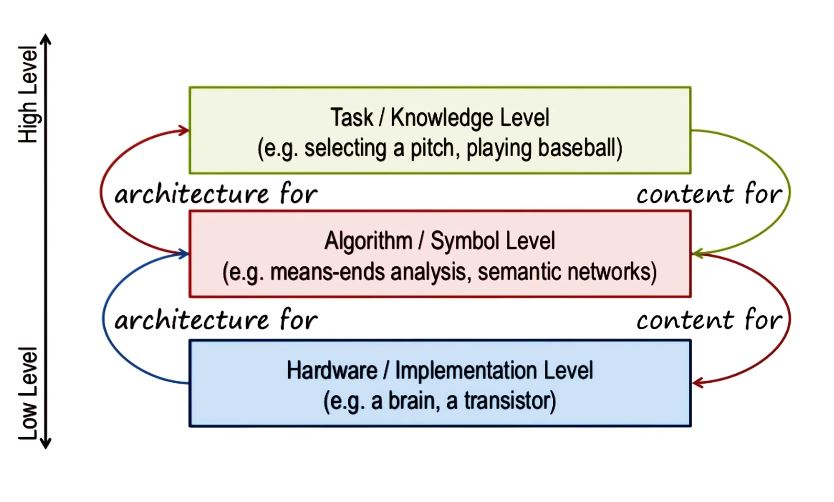
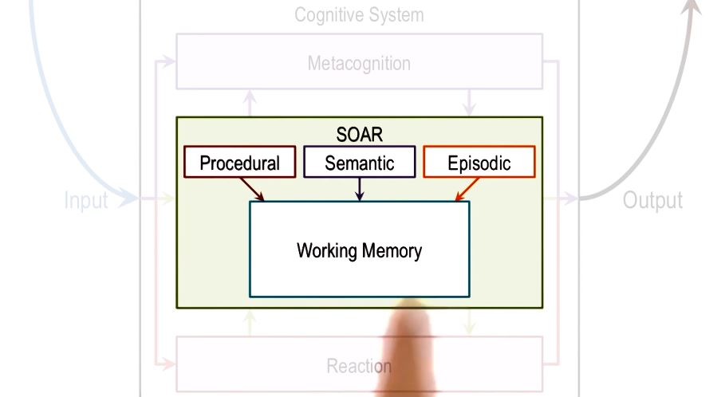

# 06 Production Systems
Production systems are kind of cognitive architecture, in which knowledge is represented in the form of rules.

## Cognitive Architectures
**Cognitive agent**- A cognitive agent is a function that maps a perceptual history into an action.

We can build queries of knowledge based AI at many levels of instructions.

This is the scale here, low level to high level. At one level, we can build queries at hardware level. So we can talk about a brain or transistor sort of microchip. At the next level, we can talk about the kinds of methods and the kinds of representations we have been talking about, means-ends analysis that has an algorithm associated with it, or semantic network that's a knowledge representation in some symbolic form.

*Assumptions:*
* Cognitive agents are goal oriented, or goal directed. They have goals and they take actions in the pursuit of those goals.
*  These cognitive agents live in a rich, complex, dynamic environments. 
* This cognitive agent used knowledge of the world in order to pursue their goals in this rich complex dynamic environments. 
* This knowledge is particular abstraction that captures the important things about the world that the level of abstraction and removes all the details. And at that level of abstraction, knowledge is captured in the form of symbols.
* The cognitive agents are very flexible.
## Production Systems

SOAR talks about three kinds of knowledge. Procedural, semantic, and episodic. Episodic knowledge has to do with events.

Specific instances of events, like, what did you have for dinner yesterday.

Semantic knowledge has to do with generalizations in the form of concepts and models of the world. For example, your concept of a human being, or your model of how a plane flies in the air.

Procedural has to do with how to do certain things. So as an example, how do you pour water from a jug into a tumbler. Notice that this makes an architecture.

There are different components that are interacting with each other.

This arrangement of components will afford certain processes of reasoning and learning.

## Chunking
An **impasse** occurs when the decision maker cannot make a decision either because not enough knowledge is available or because multiple courses of action there are being selected and the agent cannot decide among them.

SOAR has learning mechanism that allows it to encapsulate knowledge from this event into the form of a production rule that can be used as part of the procedural knowledge.

We're dealing with memory, procedural memory, we're dealing with memory that can deal with procedural knowledge and episodic knowledge.

Dealing with reasoning, decision making.

We're also dealing with learning, chunking.
